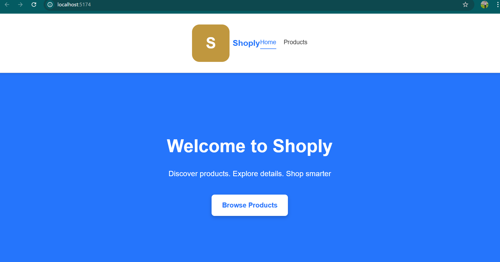
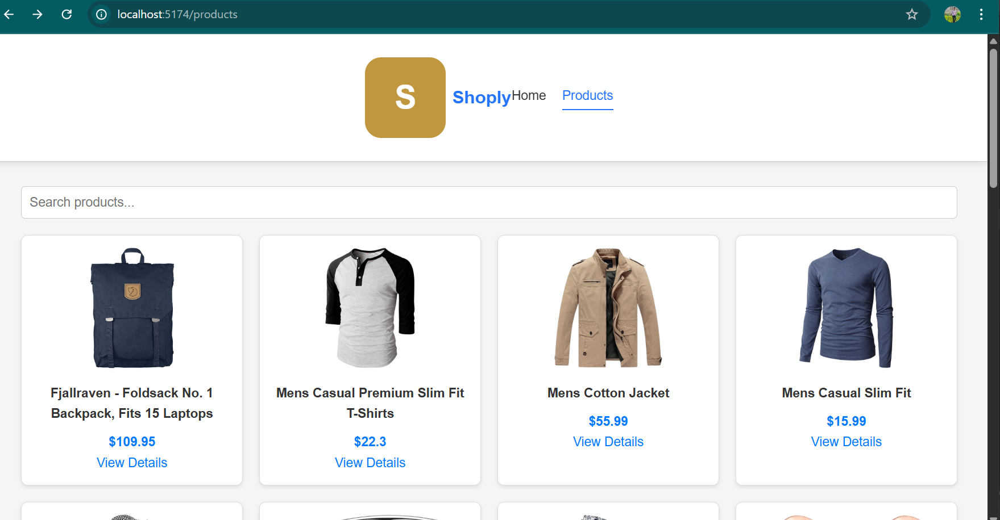
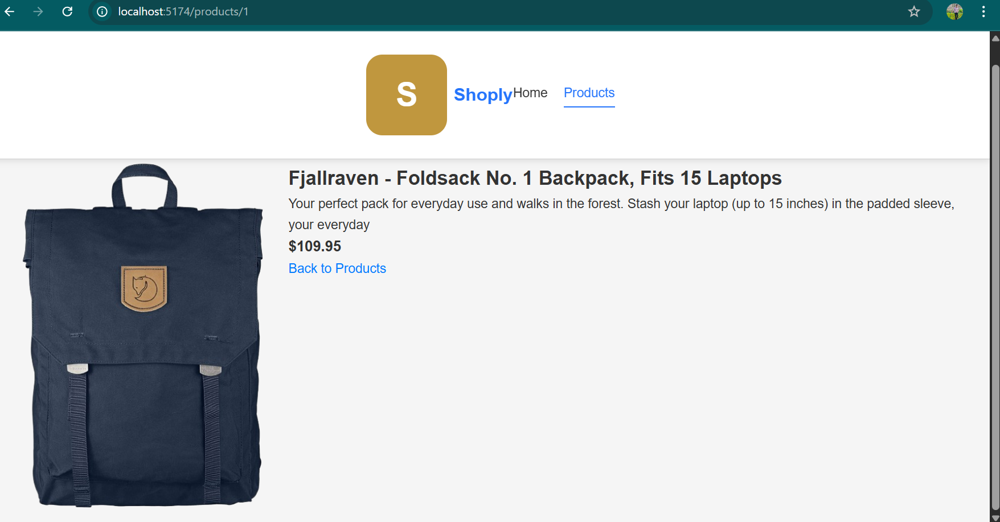

# 🛍️ Shoply – Product Explorer SPA

A modern **Single Page Application (SPA)** built with **React + Vite** that fetches and displays products from an external API. The app demonstrates routing, API integration, reusable components, and clean UI/UX — ideal for showcasing front-end development skills


## 📌 Features

* ✅ Single Page Application (SPA)
* 🔁 Client-side routing (Home → Products → Product Details)
* 🌐 External API integration (FakeStore API)
* ⏳ Loading & error handling
* 🧩 Reusable components (Navbar, Loader, ErrorMessage, Cards)
* 🔍 Product search functionality
* 📱 Responsive design (mobile, tablet, desktop)
* 🎨 Clean and modern UI

---

## 🛠️ Tech Stack

* **Frontend:** React (Vite)
* **Routing:** React Router DOM
* **API:** FakeStore API
* **Styling:** CSS / Inline Styles
* **Version Control:** Git & GitHub

---

## 📂 Folder Structure

```
spa-product-app/
│── public/
│── src/
│   ├── api/
│   │   └── api.js
│   ├── components/
│   │   ├── Navbar.jsx
│   │   ├── Loader.jsx
│   │   └── ErrorMessage.jsx
│   ├── pages/
│   │   ├── Home.jsx
│   │   ├── ProductList.jsx
│   │   └── ProductDetail.jsx
│   ├── App.jsx
│   ├── main.jsx
│── index.html
│── package.json
│── vite.config.js
```

---

## 🔗 API Used

**FakeStore API**

* Products list
* Individual product details

API Endpoint Example:

```
https://fakestoreapi.com/products
```

---

## ▶️ How to Run Locally

1. Clone the repository

```bash
git clone https://github.com/Arun1414-tech/shoply-spa.git
```

2. Navigate to project folder

```bash
cd shoply-spa
```

3. Install dependencies

```bash
npm install
```

4. Start development server

```bash
npm run dev
```

5. Open browser

```
http://localhost:5173
```

---

## 🧠 What I Learned

* Building scalable SPA architecture
* API consumption using async/await
* Handling loading & error states gracefully
* Implementing client-side routing
* Creating reusable React components
* Managing project with Git & GitHub

---

## 🚧 Challenges & Solutions

* **Blank page issue:** Fixed by correcting React Router setup and dependency versions
* **Routing errors:** Resolved by proper use of BrowserRouter and URL params
* **UI alignment:** Improved using flexbox and consistent spacing

---

## 📸 Screenshots

### 🏠 Home Page



### 📦 Product List Page



### 🔍 Product Detail Page



---

## 👤 Author

**Arun**
GitHub: [https://github.com/Arun1414-tech](https://github.com/Arun1414-tech)

---

⭐ If you like this project, feel free to star the repository!
